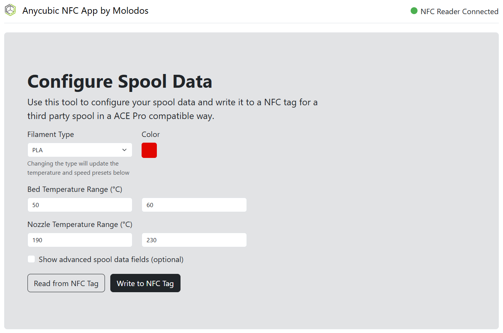
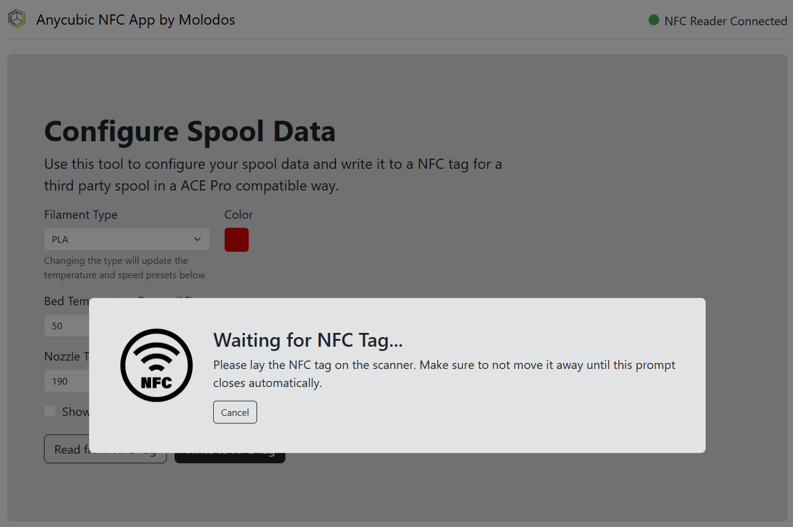

# Anycubic NFC Filament

A tool to create NFC tags compatible with the Anycubic ACE Pro for third party filament spools.

<p align="center">
  
  
</p>

## Required Hardware

> Tip: Try to get the software up and running before buying the hardware to ensure that everything works fine

The following hardware is needed (buy them via my affiliate links to support this project without additional costs):

- A supported reader from this list:
    - ACR122U NFC reader (recommended). Buy one [here](https://amzn.to/4h24oZQ) (affiliate link)
    - ACR1252U NFC reader (community-tested). Buy one [here](https://amzn.to/3E6WPUo) (affiliate link)
- NTAG213 NFC stickers. Buy some [here](https://amzn.to/4kzatQm) (affiliate link)
- (Optional) Reusable ACE Pro rings for cardboard spools with NFC sticker slot. Get the for
  free [here](https://makerworld.com/en/models/1266132-universal-cardboard-spool-adapter-ring-v2-nfc#profileId-1291900)

*Note: You will need two NFC stickers per spool of filament.*

## Using the Tool

### Option 1: Executable File for Windows Systems (Easy)

1) Download the latest `.exe` file of the
   application [here](https://github.com/Molodos/anycubic-nfc-filament/releases/latest)
2) Start the application on your Windows device by just double-clicking it
3) Open the web interface in your browser (e.g. Google Chrome) by entering http://localhost:8080 into the top bar
4) Make sure that a [ACR122U](https://amzn.to/4h24oZQ) (affiliate link) is connected to your computer
5) Done. Have fun using the software :)

#### Generating the Executable File by Yourself

> Note: This is not needed if you just download the `.exe` file

1) Install the requirements with `pip install -r requirements.txt`
2) Create the binary for your system:
   ```shell
   pyinstaller AnycubicNFCApp.spec
   ```
3) The executable can be found in the `dist` folder

### Option 2: Running the Python Script for all Systems (Intermediate)

> For a more comprehensive guide, you can check out my YouTube video [here](https://youtu.be/I4hJaSD-rVs) (German)

1) Make sure that [python 3.11](https://www.python.org/downloads/release/python-3118/) is installed on your
   computer (the version 3.11 is important, older versions should be good but newer version lead to errors)
2) Clone this repository and go to the root directory (the one with the `requirements.txt`) with a shell (on most
   operating systems, you can open the folder and then right-click and select something like `open shell here`)
3) Do the upcoming steps within the shell hust opened
4) Install the requirements with the command `pip install -r requirements.txt`
5) Start the tool with the shell command `python -m anycubic_nfc_app`
6) Open the web interface in your browser (e.g. Google Chrome) by entering http://localhost:8080 into the top bar
7) Make sure that a [ACR122U](https://amzn.to/4h24oZQ) (affiliate link) is connected to your computer
8) Done. Have fun using the software :)

## Supporting the Research

Within the tool, you can create dumps of original Anycubic spool tags to support my research. The dump of one of the two
spool sides is enough.

You can send me your dumps via email
to [anycubic-nfc-research@molodos.com](mailto:anycubic-nfc-research@molodos.com?subject=Anycubic%20NFC%20Tag%20Research&body=Material%20(e.g.%20%22PLA%2B%22)%3A%0AColor%20(e.g.%20%22Pearl%20Black%22)%3A%0AAdditional%20information%3A%0A%0A(please%20don't%20forget%20to%20attach%20the%20dump%20file)).
Please include details on which exact spool you scanned (material, color, etc.).

Thanks for your support!

## FAQ

### Why is the material type not displaying/recognized correctly on my printer?

Try updating your ACE Pro (you can do that on the top right of the "Workbench" in Anycubic Slicer Next)

### Why does the filament show as "?" in my slicer "Workbench" tab?

There currently seems to be a problem with displaying some filaments in the slicer "Workbench" tab correctly. Probably
because they are not available with official RFID chips in the store yet. But: When syncing the ACE Pro in the "Prepare"
tab in your slicer, the right filament is selected.

Currently, only the following filaments are displayed correctly in the "Workbench" tab: PLA, PLA+, PLA High Speed (if
you own official spools of other types with RFID chips, create a spool dump in the application and send it to me, to
support my research and add it to the app. Read more in [this section](#supporting-the-research))

### Why is the wrong filament type selected when syncing with the ACE Pro in the "Prepare" tab?

Make sure that the filament in the ACE Pro is available in the filament dropdown in your slicer. If not, select "
Add/Remove filament" on the bottom of the list, add the filament to the list and try syncing again.

Currently, there is another known problem where PLA+ is recognized as PLA. As I have not found a workaround yet, I
believe that it is a bug in the slicer that will also occur with official PLA+ filament from Anycubic.

### Why is the application not starting?

If the application fails to start, the error is the python version in most cases. Make sure to use version 3.11 or
older. Newer versions can lead to crashes.

### How can I use other NFC readers than the ACR122U?

Readers not on the hardware list are currently not supported. But you can still try using them by adding start options
to the application. The following two options are available:

| Option                                                                   | Description                                                                                                                                                            |
|--------------------------------------------------------------------------|------------------------------------------------------------------------------------------------------------------------------------------------------------------------|
| `--print_readers`                                                        | Add this option to print a list of connected card readers to the shell, when starting the application (use it to find the name for the second option)                  |
| `--preferred_reader "<string>"` (example: `--preferred_reader "acr122"`) | Use this option to set your preferred reader to be selected from the connected readers (it selects the last reader in the list, which contains the string in its name) |

The additional options can be added to the command starting the application:

- Option 1 (launching the exe from a shell): `AnycubicNFCApp.exe --print_readers --preferred_reader "acr122"`
- Option 2 (python script): `python -m anycubic_nfc_app --print_readers --preferred_reader "acr122"`

## Credits

Special thanks
to [u/SnooCheesecakes1269](https://www.reddit.com/user/SnooCheesecakes1269/), [u/kivulhepy](https://www.reddit.com/user/kivulhepy/), [u/Nearby_Farmer_4983](https://www.reddit.com/user/Nearby_Farmer_4983/)
for providing me with NFC tag dumps, so I was able to reverse-engineer the format of the tags.
